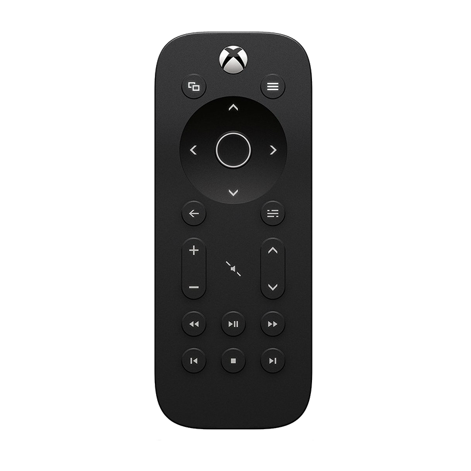

# XboxRemoteController Xbox远程遥控器

---

---
# 使用说明
1.必须要跟xbox在同一局域网内(比如同一wifi下)

2.在app的侧边栏面板->设置界面填入xbox的liveid和ip地址，liveid在xbox开机后按西瓜键打开设定->系统->系统信息里面找；
  如果找不到，可以在xbox开机后，在app的侧边栏面板->附近xbox列表里面找到你自己的xbox，点击连接

4.目前只有关机、开机、西瓜键、上下左右，确定，返回，菜单，视图，这些键有用。

---
### 引用的项目列表
>1.[BouncyCastle.Crypto.dll](http://www.bouncycastle.org/csharp/)

>2.[Newtonsoft.Json.dll](https://github.com/JamesNK/Newtonsoft.Json)

>3.[RestSharp](https://github.com/restsharp/RestSharp)

>4.[SmartGlass](https://github.com/OpenXbox/xbox-smartglass-csharp)
  
